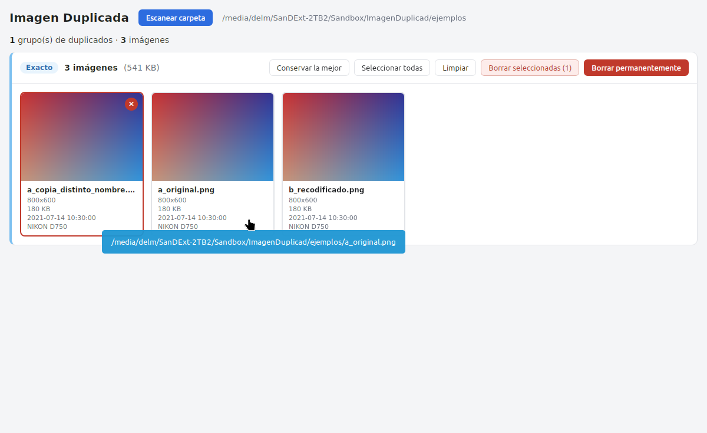
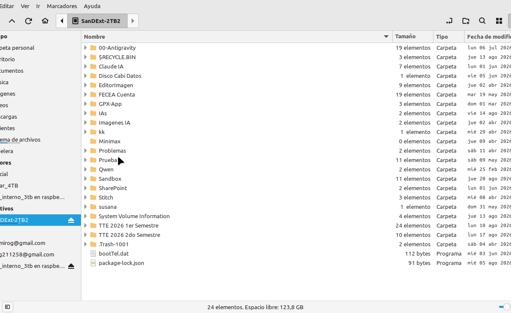
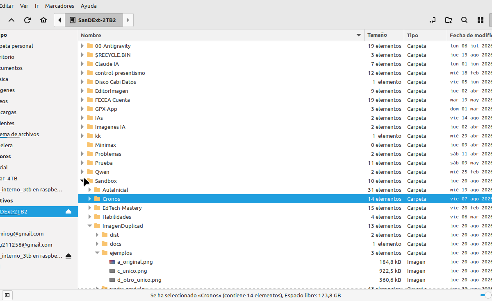

# Imagen Duplicada - Guia de Uso

Detector de imagenes duplicadas con comparacion por hash (SHA-256) y metadatos EXIF.

---

## Requisitos previos

### Linux (Ubuntu/Mint/Debian)

```bash
sudo apt install -y libwebkit2gtk-4.1-dev libssl-dev librsvg2-dev patchelf build-essential
```

### Windows

- WebView2 Runtime (preinstalado en Windows 10/11)
- Rust (https://rustup.rs)
- Node.js 18+

### macOS

```bash
xcode-select --install
brew install wget
```

### Instalacion de Rust (todos los Sistemas)

```bash
curl --proto '=https' --tlsv1.2 -sSf https://sh.rustup.rs | sh -s -- -y --profile minimal
source "$HOME/.cargo/env"
```

---

## Instalacion del proyecto

```bash
git clone <repositorio>
cd ImagenDuplicad
npm install
```

---

## Ejecutar en modo desarrollo

```bash
npm run tauri dev
```

Esto compila el backend Rust y abre la ventana de la aplicacion con recarga en vivo.

---

## Generar instalador

### Linux (.deb y AppImage)

```bash
npx tauri build
```

Los instaladores se generan en `src-tauri/target/release/bundle/`:

- `bundle/deb/` - Paquete .deb para Debian/Ubuntu
- `bundle/appimage/` - AppImage portable

### Windows (.exe / .msi)

```bash
npx tauri build
```

Genera instalador NSIS en `src-tauri/target/release/bundle/nsis/`.

---

## Uso de la aplicacion

### Paso 1: Seleccionar carpeta

1. Abre la aplicacion "Imagen Duplicada"
2. Haz clic en **"Escanear carpeta"**
3. Navega hasta la carpeta que contiene tus imagenes y seleccionala


### Paso 2: Revisar resultados

La aplicacion escanea recursivamente todas las imagenes y las agrupa:

- **Grupo exacto** (azul): Imagenes con hash SHA-256 identico (copias byte a byte)
- **Grupo probable** (naranja): Imagenes con distintos hashes pero misma fecha de captura, dimensiones y camara

Cada grupo muestra las imagenes lado a lado con:

- Vista en miniatura
- Nombre de archivo
- Dimensiones (ancho x alto)
Tamano de archivo
- Fecha de captura (EXIF) o de modificacion
- Modelo de camara



### Paso 3: Vista previa ampliada

Haz clic en la miniatura de cualquier imagen para abrirla en tamaño completo y verificar su contenido antes de decidir.



### Paso 4: Seleccionar y borrar

1. Haz clic en las imagenes que quieras eliminar (se marcan con un circulo rojo)
2. Usa los botones de accion:
   - **"Conservar la mejor"**: Selecciona automaticamente todas menos la de mayor resolucion
   - **"Seleccionar todas"**: Marca todas las imagenes del grupo
   - **"Limpiar"**: Deselecciona todo
3. Elige el metodo de eliminacion:
   - **"Borrar seleccionadas"**: Envía las imagenes a la papelera de reciclaje (puedes recuperarlas)
   - **"Borrar permanentemente"**: Elimina los archivos sin posibilidad de recuperacion



---

## Algoritmo de deteccion

La aplicacion utiliza un algoritmo de union-find que combina dos criterios:

1. **Comparacion por hash (SHA-256)**: Calcula el hash criptografico de cada archivo. Si dos archivos tienen el mismo hash, son duplicados exactos.

2. **Comparacion por metadatos EXIF**: Extrae fecha de captura, modelo de camara y dimensiones. Si dos imagenes distintas tienen los mismos metadatos, son probables duplicados (recodificados).

3. **Fusion**: Si un grupo de duplicados exactos comparte metadatos con otra imagen, se fusionan en un solo grupo con confianza "exacto".

### Orden de prioridad

Dentro de cada grupo, las imagenes se ordenan por:

1. Mayor resolucion (pixeles totales)
2. Fecha de captura (más antigua primero)
3. Ruta del archivo (alfabetico)

---

## Formatos soportados

JPEG, PNG, WebP, GIF, TIFF, BMP

---

## Estructura del proyecto

```
ImagenDuplicad/
  src/                    Frontend React + TypeScript
    components/
      GroupCard.tsx        Tarjeta de grupo de duplicados
      ImageViewer.tsx      Visor de imagen ampliada
    App.tsx                Componente principal
    styles.css             Estilos de la aplicacion
    types.ts               Definiciones de tipos
    lib/format.ts          Funciones de formato
  src-tauri/               Backend Rust
    src/
      main.rs              Punto de entrada
      lib.rs               Modulos y configuracion
      scanner.rs           Escaneo recursivo de archivos
      hasher.rs            Calculo SHA-256
      metadata.rs          Extraccion EXIF
      matcher.rs           Agrupacion con union-find
      thumbnails.rs        Generacion de miniaturas
      commands.rs          Comandos Tauri IPC
  docs/                    Documentacion
    presentacion/          Presentacion de la app
      imagenes/            Screenshots de la aplicacion
  ejemplos/                Imagenes de prueba
```

---

## Comandos utiles

```bash
# Desarrollo
npm run tauri dev

# Tests del matcher
cd src-tauri && cargo test

# Build release
npx tauri build

# Ejecutar el binario directamente
src-tauri/target/debug/imagen-duplicada
```

---

## Solucion de problemas

### "No se pudieron instalar algunos paquetes" (Linux)

El paquete `libappindicator3-dev` entra en conflicto con `libayatana-appindicator3-1`. Ejecuta sin ese paquete:

```bash
sudo apt install -y libwebkit2gtk-4.1-dev libssl-dev librsvg2-dev patchelf build-essential
```

### La app no encuentra imagenes

- Verifica que la carpeta contenga imagenes en formatos soportados (JPEG, PNG, WebP, GIF, TIFF, BMP)
- Las imagenes en subcarpetas se escanean automaticamente

### Las imagenes EXIF no muestran fecha

No todas las imagenes tienen metadatos EXIF. Las imagenes descargadas de internet o capturas de pantalla suelen carecer de ellos. En esos casos, la deteccion de duplicados se basa unicamente en el hash SHA-256.

### Windows: la app no abre

Verifica que WebView2 Runtime este instalado. Descargalo desde: https://developer.microsoft.com/en-us/microsoft-edge/webview2/
